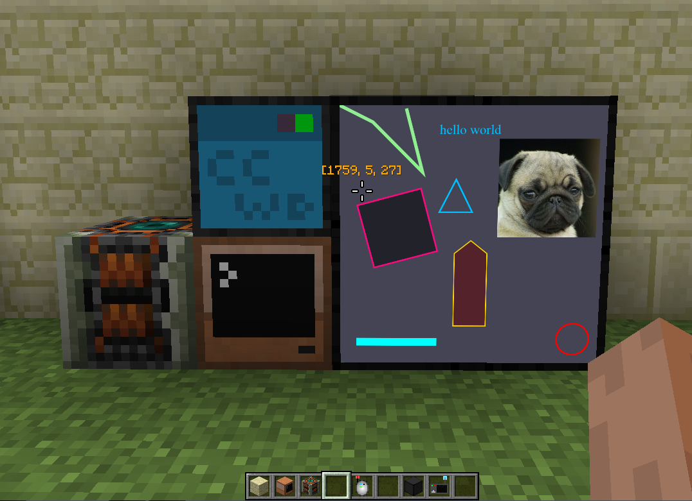

### Minecraft mod computercraft webdisplays fabric.js wrapper



### Usage

```lua
require "canvas"

local wd = peripheral.wrap("top")

canvas.clear(wd)

canvas.line(wd, 
  { 50, 720, 300, 720 }, 
  { fill = "cyan", stroke = "cyan", strokeWidth = 25 }
)

canvas.image(wd, 
  "http://fabricjs.com/assets/pug_small.jpg", 
  { left = 480, top = 100, width = 300, height = 300 }
)

canvas.rect(wd, { 
  fill = "rgba(0,0,0,0.5)", 
  angle = -15, 
  stroke = "#f70a7d", 
  strokeWidth = 5,
  width = 200,
  height = 200,
  top = 300,
  left = 50
})


canvas.circle(wd, {
  radius = 50,
  fill = 'rgba(0,0,0,0)',
  top = 670,
  left = 670,
  strokeWidth = 5,
  stroke = 'red'
})

canvas.polyline(wd, 
  { 
    { x = 0, y = 0 }, 
    { x = 100, y = 50 }, 
    { x = 250, y = 200 }, 
    { x = 200, y = 10 }
  }, 
  {
    fill = 'rgba(0,0,0,0)',
    stroke = 'lightgreen',
    strokeWidth = 10
  }
)


canvas.polygon(wd, 
  {
    { x = 400, y = 410 },
    { x = 450, y = 450 },
    { x = 450, y = 680 },
    { x = 350, y = 680 },
    { x = 350, y = 450 }
  }, 
  {
    fill = 'rgba(100,0,0,0.5)', 
    stroke = "gold",
    strokeWidth = 3
  }
)


canvas.text(wd, 'hello world', {
    fill = "deepskyblue",
    fontSize = 40,
    left = 300,
    top = 50
}

canvas.triangle(wd, {
    width = 100, 
    height = 100, 
    left = 300, 
    top = 220,  
    fill = 'rgba(0,0,0,0)',
    stroke = 'deepskyblue', 
    strokeWidth = 5
})

--[[
setInterval(()=>{

}, 100)

function setInterval ()

end
setInterval ( draw, 1000)
]]

```

[fabric.js](http://fabricjs.com/docs/index.html)

<s>[ccwd](https://montoyo.net/wdwiki/index.php?title=OpenComputers_Interface)</s> - Module ccwd is repeated by the API of that module